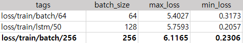

# [LyricGenerator Using Pytorch]

## 목차
[1. 프로젝트 개요](#1-프로젝트-개요) 
[2. 데이터 수집](#2-데이터-수집) 
[3. 데이터 전처리](#3-데이터-전처리) 
[4. 모델링](#4-모델링) 
[5. 성능 평가](#5-성능-평가) 
[6. 결론](#6-결론) 

---

## 1. 프로젝트 개요
* 목표 : 작사 모델 구현(Word-Based)
* 주요 패키지 : Pytorch

## 2. 데이터 수집
작사 모델 구현을 위한 가사 데이터 수집 
* 사용 API : Spotify Lyrics API
* 수집 범위
    * 멜론 월간 차트 TOP 100
        * 2021년 10월, 11월
        * 2022년 10월, 11월
        * 2023년 10월, 11월
    * 한 가수의 전체 노래 가사
* 데이터 사이즈 : 가사 약 35.000(줄)
* 수집 형태 : 텍스트 파일(txt)

## 3. 데이터 전처리
### 데이터 전처리 포인트
#### [토큰화] K-pop 가사들은 한국어 + 영어의 혼합 형태가 대부분. 어떻게 처리할 것인가?
* 문제 1 : 가사의 특성상, 문장 구조가 지켜지지 않거나 문장이 되지 않는 경우가 많다.  
--> 보통의 한국어 문장 분석 시 사용하는 문장 구조 분석이나 품사 분류가 의미가 없을 수 있다. 
 
* 방법 : 띄어쓰기 기준으로 분리 

#### [정규화] 표기가 다양한 가사 데이터, 어떻게 처리할 것인가?
* 문제 1 : 가사에는 다양한 문장 부호가 포함되지만, 문자와 붙어있어 띄어쓰기로는 분류되지 않는다.
* 문제 2 : 대/소문자로 구분되어 모두 다른 단어로 분류된다. 
  
* 방법 : 문장 부호 사전을 만들어 모두 토큰 형태로 Replace 하기, 대/소문자 통합하기

#### [정제] 토큰화에 방해되는 데이터가 있는가? 있다면 어떻게 처리할 것인가?
* 문제 1 : 가사 속 표현을 공식적인 표기로 통일한다면, 가사의 특성을 살릴 수 없다. 
--> 정제를 최소한으로 진행
* 방법 : 공백 줄과 괄호만 제거

### 단어 사전 만들기
문자 데이터를 예측 모델에 사용하기 위해서는 단어 사전을 만드는 작업이 필요하다.  
#### Word2idx : Word to Index
 
#### Idx2word : Index to Word
 

## 4. 모델링
### 텍스트 생성 원리
#### [Train] Skip-Gram
Word2Vec 중 성능이 더 높다고 알려져 있는 Skip-Gram 방식을 사용 
 
시퀀스는 윈도우 형태로 동작한다. 윈도우는 중심 단어를 하나씩 옮겨가면서 윈도우에 단어를 넣는다. 이런 방식으로 나올 수 있는 순서쌍을 학습하는 방식이다.  
*윈도우 안에 있는 가장 마지막 데이터가 Label, 그 앞 데이터들은 Feature가 된다. 
#### [Test] Top-K Sampling
가장 확률이 높은 K개의 다음 단어들을 필터링, 확률 질량을 해당 단어들에 재분배하는 방식이다. 
 
*분류와 비슷한 동작 구조

### 코드 구조
 

## 5. 성능 평가
### 성능 평가 기준 : nn.CrossEntropyLoss
분류와 비슷한 동작 구조로 분류에 사용되는 CrossEntorpyLoss을 성능 기준으로 사용한다. 
Pytorch의 CrossEntropyLoss 수식은 다음과 같다. 
 
softmax에 log를 취한 LogSoft와 NLLLoss가 혼합된 형태이다. 
* 동작 구조 : Softmax -> Log 취하기 -> 음수를 양수로 -> 평균/합 구하기
* Softmax에 Log를 취하는 이유?
  
 확률이 0에 가까울수록 높은 Loss 값을 가지게 되고, 1에 가까울수록 낮은 Loss 값을 가지게 되는 원리로, 안정적인 모델을 만들 수 있다. 

### 성능 비교
성능 비교를 위해 학습 단계에서 tensorboard로 scalar 기록. 
epoch 제외, 가장 높은 성능을 보인 옵션을 다음 항목 실험에 적용

#### Epoch
 
#### Learning Rate
 
#### Batch Size
 
#### Dropout
 
#### Sequence Length
 
#### Top100 vs 한 가수만
 

## 6. 결론
### 모델 튜닝 결과
#### 초기 모델
* Model Name : Loss/train/epoch/10
* Epoch : 10
* Sequence_length : 10
* Batch_size : 128
* Learning_rate : 0.001
* Dropout : 0.1
* Min loss : 1.2479
#### 최종 모델
* Model Name : Loss/train/dropout/0.1
* Epoch : 50
* Sequence_length : 10
* Batch_size : 256
* Learning_rate : 0.001
* Dropout : 0.1
* Min loss : 0.0492

 

